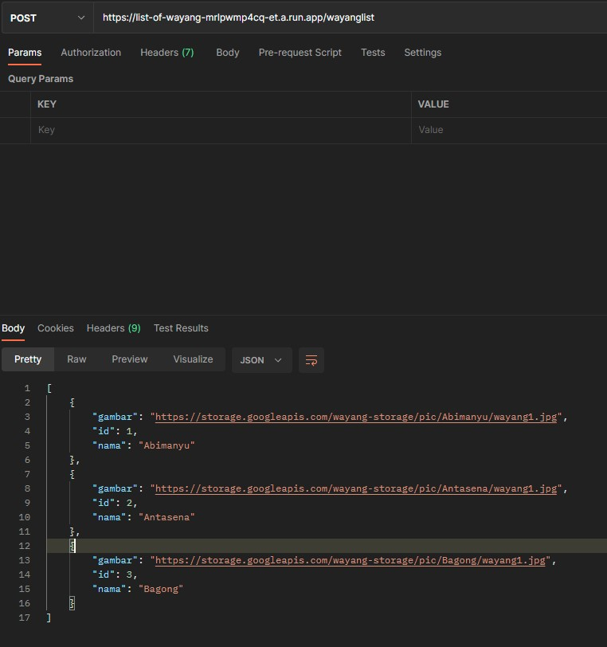
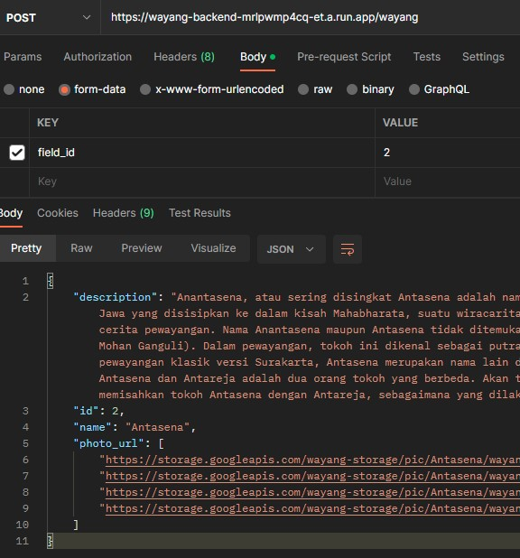
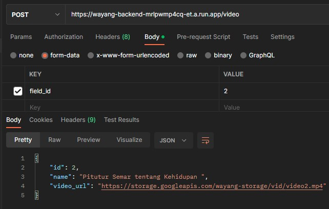

# Cloud_Computing
Backend or Something that reeks of cloud computing

## API Docoumentation

### Wayang Prediction API
#### Endpoint:
> https://wayang-prediction-mrlpwmp4cq-et.a.run.app

### Predict:
* URL
    - /predict
* Method
    - POST
* Request Body
    * `file` as file, must be valid image file, max size <= 2MB
* Response
    > 200 OK
    ```json
    {
        "id": 3,
        "message": "success",
        "result": "Bagong"
    }
    ```


### Wayang Details or All API
#### Endpoint:
> https://list-of-wayang-mrlpwmp4cq-et.a.run.app

### Lists:
* URL
    - /wayanglist
* Method
    - POST
* Request Body
    * -
* Response
    > 200 OK
    ```json
    [
        {
            "id": 1,
            "name": "Abimanyu",
            "photo_url": "https://storage.googleapis.com/wayang-storage/pic/Abimanyu/wayang1.jpg"
        },
        {
            "id": 2,
            "name": "Antasena",
            "photo_url": "https://storage.googleapis.com/wayang-storage/pic/Antasena/wayang1.jpg"
        },
        {
            "id": 3,
            "name": "Bagong",
            "photo_url": "https://storage.googleapis.com/wayang-storage/pic/Bagong/wayang1.jpg"
        }
    ]
    ```


### Details of Wayang:
* URL
    - /wayang
* Method
    - POST
* Request Body
    * `field_id` as integer, must be valid id
* Response
    > 200 OK
    ```json
    {
        "description": "Anantasena, atau sering disingkat Antasena adalah nama salah satu tokoh pewayangan Jawa. Tokoh ini merupakan ciptaan para pujangga Jawa yang disisipkan ke dalam kisah Mahabharata, suatu wiracarita kuno karya Krishna Dwaipayana Byasa dari India, yang sering diadaptasi menjadi cerita pewayangan. Nama Anantasena maupun Antasena tidak ditemukan dalam naskah asli Mahabharata berbahasa Sanskerta (diterjemahkan oleh Kisari Mohan Ganguli). Dalam pewayangan, tokoh ini dikenal sebagai putra bungsu Bimasena, serta saudara lain ibu dari Antareja dan Gatotkaca. Dalam pewayangan klasik versi Surakarta, Antasena merupakan nama lain dari Antareja, yaitu putra sulung Bimasena. Sementara menurut versi Yogyakarta, Antasena dan Antareja adalah dua orang tokoh yang berbeda. Akan tetapi dalam pewayangan zaman sekarang, para dalang Surakarta sudah biasa memisahkan tokoh Antasena dengan Antareja, sebagaimana yang dilakukan oleh para dalang Yogyakarta.",
        "id": 2,
        "name": "Antasena",
        "photo_url": [
            "https://storage.googleapis.com/wayang-storage/pic/Antasena/wayang1.jpg",
            "https://storage.googleapis.com/wayang-storage/pic/Antasena/wayang2.jpg",
            "https://storage.googleapis.com/wayang-storage/pic/Antasena/wayang3.jpg",
            "https://storage.googleapis.com/wayang-storage/pic/Antasena/wayang4.jpg"
        ]
    }
    ```


### List all of Video:
* URL
    - /videolist
* Method
    - POST
* Request Body
    * -
* Response
    > 200 OK
    ```json
    [
        {
            "id": 1,
            "name": "Wayang kulit nasehat Semar kepada anak cucunya",
            "video_url": "https://storage.googleapis.com/wayang-storage/vid/video1.mp4"
        },
        {
            "id": 2,
            "name": "Pitutur Semar tentang Kehidupan ",
            "video_url": "https://storage.googleapis.com/wayang-storage/vid/video2.mp4"
        }
    ]
    ```


### Details of Video:
* URL
    - /video
* Method
    - POST
* Request Body
    * `field_id` as integer, must be valid id
* Response
    > 200 OK
    ```json
    {
        "id": 2,
        "name": "Pitutur Semar tentang Kehidupan ",
        "video_url": "https://storage.googleapis.com/wayang-storage/vid/video2.mp4"
    }
    ```

