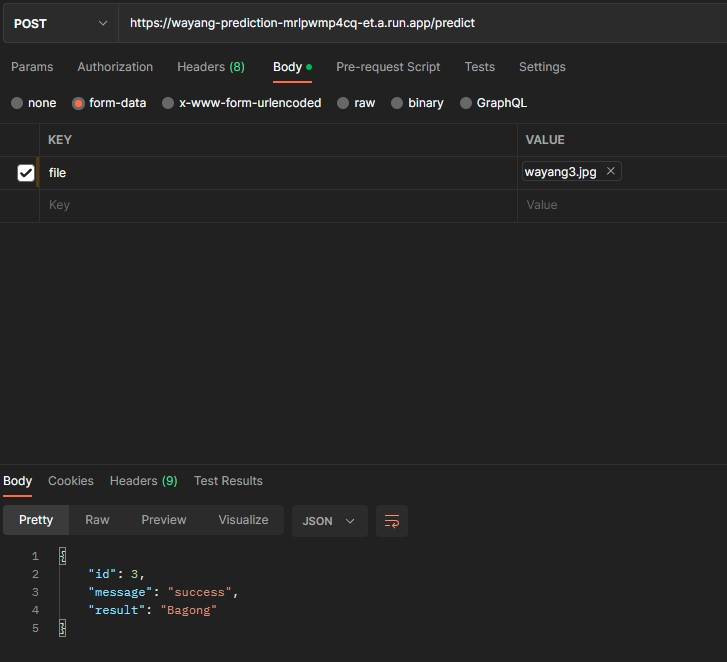

# Cloud_Computing
Backend or Something that reeks of cloud computing

## API Docoumentation

### Wayang Prediction API
#### Endpoint:
> https://wayang-prediction-mrlpwmp4cq-et.a.run.app

#### Predict:
* URL
    - /predict
* Method
    - POST
* Request Body
    * file as file, must be valid image file, max size <= 2MB
* Response
    > 200 OK
    ```json
    {
        "result": "Gatot Kaca"

    }
    ```



