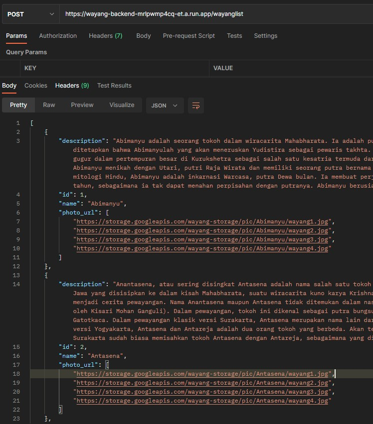

# Cloud_Computing
Backend or Something that reeks of cloud computing

## API Docoumentation

### Wayang Prediction API
#### Endpoint:
> https://wayang-prediction-mrlpwmp4cq-et.a.run.app

### Predict:
* URL
    - /predict
* Method
    - POST
* Request Body
    * `file` as file, must be valid image file, max size <= 2MB
* Response
    > 200 OK
    ```json
    {
        "id": 3,
        "message": "success",
        "result": "Bagong"
    }
    ```


### Wayang Details or All API
#### Endpoint:
> https://wayang-backend-mrlpwmp4cq-et.a.run.app

### Lists:
* URL
    - /wayanglist
* Method
    - POST
* Request Body
    * -
* Response
    > 200 OK
    ```json
    [
        {
            "description": "Abimanyu adalah seorang tokoh dalam wiracarita Mahabharata. Ia adalah putra Arjuna dan Subadra. Dalam wiracarita Mahabharata, ditetapkan bahwa Abimanyulah yang akan meneruskan Yudistira sebagai pewaris takhta. Riwayatnya dituturkan sebagai pahlawan yang tragis. Ia gugur dalam pertempuran besar di Kurukshetra sebagai salah satu kesatria termuda dari pihak Pandawa, karena baru berusia enam belas tahun. Abimanyu menikah dengan Utari, putri Raja Wirata dan memiliki seorang putra bernama Parikesit, yang lahir tak lama setelah ia gugur. Menurut mitologi Hindu, Abimanyu adalah inkarnasi Warcasa, putra Dewa bulan. Ia membuat perjanjian bahwa putranya tinggal di Bumi hanya selama 16 tahun, sebagaimana ia tak dapat menahan perpisahan dengan putranya. Abimanyu berusia 16 tahun saat ia terbunuh dalam pertempuran",
            "id": 1,
            "name": "Abimanyu",
            "photo_url": [
                "https://storage.googleapis.com/wayang-storage/pic/Abimanyu/wayang1.jpg",
                "https://storage.googleapis.com/wayang-storage/pic/Abimanyu/wayang2.jpg",
                "https://storage.googleapis.com/wayang-storage/pic/Abimanyu/wayang3.jpg",
                "https://storage.googleapis.com/wayang-storage/pic/Abimanyu/wayang4.jpg"
            ]
        },
        {
            "description": "Anantasena, atau sering disingkat Antasena adalah nama salah satu tokoh pewayangan Jawa. Tokoh ini merupakan ciptaan para pujangga Jawa yang disisipkan ke dalam kisah Mahabharata, suatu wiracarita kuno karya Krishna Dwaipayana Byasa dari India, yang sering diadaptasi menjadi cerita pewayangan. Nama Anantasena maupun Antasena tidak ditemukan dalam naskah asli Mahabharata berbahasa Sanskerta (diterjemahkan oleh Kisari Mohan Ganguli). Dalam pewayangan, tokoh ini dikenal sebagai putra bungsu Bimasena, serta saudara lain ibu dari Antareja dan Gatotkaca. Dalam pewayangan klasik versi Surakarta, Antasena merupakan nama lain dari Antareja, yaitu putra sulung Bimasena. Sementara menurut versi Yogyakarta, Antasena dan Antareja adalah dua orang tokoh yang berbeda. Akan tetapi dalam pewayangan zaman sekarang, para dalang Surakarta sudah biasa memisahkan tokoh Antasena dengan Antareja, sebagaimana yang dilakukan oleh para dalang Yogyakarta.",
            "id": 2,
            "name": "Antasena",
            "photo_url": [
                "https://storage.googleapis.com/wayang-storage/pic/Antasena/wayang1.jpg",
                "https://storage.googleapis.com/wayang-storage/pic/Antasena/wayang2.jpg",
                "https://storage.googleapis.com/wayang-storage/pic/Antasena/wayang3.jpg",
                "https://storage.googleapis.com/wayang-storage/pic/Antasena/wayang4.jpg"
            ]
        },
        {
            "description": "Ki Lurah Bagong adalah nama salah satu tokoh punakawan dalam kisah pewayangan yang berkembang di Jawa Tengah, Yogyakarta, dan Jawa Timur. Tokoh ini dikisahkan sebagai anak dari Semar. Dalam pewayangan Sunda juga terdapat tokoh panakawan yang identik dengan Bagong, yaitu Cepot atau Astrajingga. Namun bedanya, menurut versi ini, Cepot adalah anak tertua Semar. Dalam wayang banyumasan Bagong lebih dikenal dengan sebutan Bawor. Sebagai seorang panakawan yang sifatnya menghibur penonton wayang, tokoh Bagong pun dilukiskan dengan ciri-ciri fisik yang mengundang kelucuan. Tubuhnya bulat, matanya lebar, bibirnya tebal dan terkesan memble. Dalam figur wayang kulit, Bagong membawa senjata kudi. Gaya bicara Bagong terkesan semaunya sendiri. Dibandingkan dengan ketiga panakawan lainnya, yaitu Semar, Gareng, dan Petruk, maka Bagong adalah sosok yang paling lugu dan kurang mengerti tata krama. Meskipun demikian majikannya tetap bisa memaklumi.",
            "id": 3,
            "name": "Bagong",
            "photo_url": [
                "https://storage.googleapis.com/wayang-storage/pic/Bagong/wayang1.jpg",
                "https://storage.googleapis.com/wayang-storage/pic/Bagong/wayang2.jpg",
                "https://storage.googleapis.com/wayang-storage/pic/Bagong/wayang3.jpg",
                "https://storage.googleapis.com/wayang-storage/pic/Bagong/wayang4.jpg"
            ]
        }
    ]
    ```


### Details of Wayang:
* URL
    - /wayang
* Method
    - POST
* Request Body
    * `field_id` as integer, must be valid id
* Response
    > 200 OK
    ```json
    {
        "description": "Anantasena, atau sering disingkat Antasena adalah nama salah satu tokoh pewayangan Jawa. Tokoh ini merupakan ciptaan para pujangga Jawa yang disisipkan ke dalam kisah Mahabharata, suatu wiracarita kuno karya Krishna Dwaipayana Byasa dari India, yang sering diadaptasi menjadi cerita pewayangan. Nama Anantasena maupun Antasena tidak ditemukan dalam naskah asli Mahabharata berbahasa Sanskerta (diterjemahkan oleh Kisari Mohan Ganguli). Dalam pewayangan, tokoh ini dikenal sebagai putra bungsu Bimasena, serta saudara lain ibu dari Antareja dan Gatotkaca. Dalam pewayangan klasik versi Surakarta, Antasena merupakan nama lain dari Antareja, yaitu putra sulung Bimasena. Sementara menurut versi Yogyakarta, Antasena dan Antareja adalah dua orang tokoh yang berbeda. Akan tetapi dalam pewayangan zaman sekarang, para dalang Surakarta sudah biasa memisahkan tokoh Antasena dengan Antareja, sebagaimana yang dilakukan oleh para dalang Yogyakarta.",
        "id": 2,
        "name": "Antasena",
        "photo_url": [
            "https://storage.googleapis.com/wayang-storage/pic/Antasena/wayang1.jpg",
            "https://storage.googleapis.com/wayang-storage/pic/Antasena/wayang2.jpg",
            "https://storage.googleapis.com/wayang-storage/pic/Antasena/wayang3.jpg",
            "https://storage.googleapis.com/wayang-storage/pic/Antasena/wayang4.jpg"
        ]
    }
    ```


### List all of Video:
* URL
    - /videolist
* Method
    - POST
* Request Body
    * -
* Response
    > 200 OK
    ```json
    [
        {
            "id": 1,
            "name": "Wayang kulit nasehat Semar kepada anak cucunya",
            "photo_url": "https://storage.googleapis.com/wayang-storage/pic/ssvideo/video1.jpg",
            "video_url": "https://storage.googleapis.com/wayang-storage/vid/video1.mp4"
        },
        {
            "id": 2,
            "name": "Pitutur Semar tentang Kehidupan ",
            "photo_url": "https://storage.googleapis.com/wayang-storage/pic/ssvideo/video2.jpg",
            "video_url": "https://storage.googleapis.com/wayang-storage/vid/video2.mp4"
        }
    ]
    ```


### Details of Video:
* URL
    - /video
* Method
    - POST
* Request Body
    * `field_id` as integer, must be valid id
* Response
    > 200 OK
    ```json
    {
        "id": 2,
        "name": "Pitutur Semar tentang Kehidupan",
        "photo_url": "https://storage.googleapis.com/wayang-storage/pic/ssvideo/video2.jpg",
        "video_duration": "7:37",
        "video_url": "https://storage.googleapis.com/wayang-storage/vid/video2.mp4"
    }
    ```

